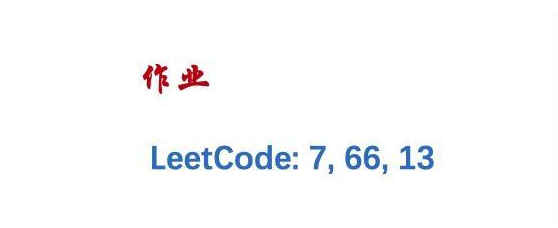

# Algorithm Homework 2

> 姓名：阙建明
>
> 学号：1901213139

## 作业要求：



## 题解

- ### Leetcode problem 7

  > [整数反转](https://leetcode-cn.com/problems/reverse-integer/)

  - **算法思路：**

    - 首先记录是否为负数，接着将输入值取整
    - 用模10取余的方式依次得到反转的每一位，然后拼接到一个 *result* 当中
    - 最后判断是否溢出，溢出则返回0，不溢出则返回 *result* 或 *-result* 

  - **Leetcode提交结果：**

    

  - **代码：**

    ```python
    INT_MAX_VAL = 2147483647
    INT_MIN_VAL = -2147483648
    class Solution:
        def reverse(self, x: int) -> int:
            isNegitive = -1 if x < 0 else 1
            result, x = 0, abs(x)
            while x > 0:
                result = result * 10 + x % 10
                x //= 10
            return 0 if result > INT_MAX_VAL or result < INT_MIN_VAL else isNegitive * result
    ```

- ### Leetcode problem 13

  > [罗马数字转整数](https://leetcode-cn.com/problems/roman-to-integer/)

  - **算法思路：**

    - 首先对于 *M、D、L、V*，可直接返回对应代表的数值
    - 对于 *C、X、I*，则如果右边出现可与之搭配成9 × 10n 或者 4 × 10n（n = 0, 1, 2）的情况，返回负的对应数值，否则返回正的对应数值

  - **Leetcode提交结果：**

    

  - **代码：**

    ```python
    class Solution:
        def romanToInt(self, s: str) -> int:
            result, length = 0, len(s)
            for i in range(0, length):
                if s[i] == 'M':
                    result += 1000
                elif s[i] == 'D':
                    result += 500
                elif s[i] == 'C':
                    if i < length - 1 and (s[i + 1] == 'M' or s[i + 1] == 'D'):
                        result -= 100
                    else:
                        result += 100
                elif s[i] == 'L':
                    result += 50
                elif s[i] == 'X':
                    if i < length - 1 and (s[i + 1] == 'L' or s[i + 1] == 'C'):
                        result -= 10
                    else:
                        result += 10
                elif s[i] == 'V':
                    result += 5
                elif s[i] == 'I':
                    if i < length - 1 and (s[i + 1] == 'V' or s[i + 1] == 'X'):
                        result -= 1
                    else:
                        result += 1
            return result
    ```

- ### Leetcode problem 3

  > [加一](https://leetcode-cn.com/problems/plus-one/)

  - **算法思路：**
  
  - 从后往前遍历，每次 + 1，如果和等于10，则发生进位，否则算法返回
    - 遍历结束发现 *tmp* 仍然不为0，则表示数组的值为全9，需要在数组前添加一个元素

  - **Leetcode提交结果：**

    

  - **代码：**
  
    ```python
    class Solution:
        def plusOne(self, digits: List[int]) -> List[int]:
            tmp = digits[len(digits) - 1] + 1
            digits[len(digits) - 1], tmp, index = tmp % 10, tmp // 10, len(digits) - 2
            while tmp != 0 and index >= 0:
                tmp = digits[index] + 1
                digits[index], tmp = tmp % 10, tmp // 10
                index -= 1
            if tmp != 0:
                digits.insert(0, 1)
          return digits
    ```
  
    