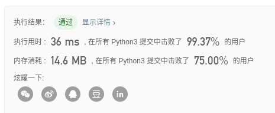
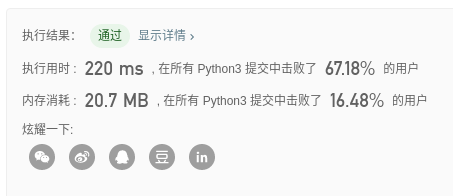
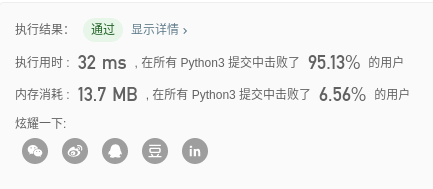

# Algorithm Homework 5

> 姓名：阙建明
>
> 学号：1901213139

## 作业要求：

Leetcode: 56，148，274

## 题解：

- ### Leetcode problem 56

  >  [合并区间](https://leetcode-cn.com/problems/merge-intervals/)

  - **算法思路：** 

    - 首先对列表从小到大排序；
    - 然后用两个指针，一个cur指向当前值，一个next指向下一个要对比的值；
    - 如果下一个元素的左边界比当前元素的右边界要大，则无需合并，next右移；
    - 如果下一个元素的左边界小于等于当前元素的右边界，则需要合并，进一步判断下一个元素的右边界是否大于当前元素的右边界，如果是，则修改当前元素的右边界为下一个元素的右边界。接着next右移

  - **Leetcode提交结果：**

    

  - **代码：**

    ```python
    class Solution:
        def merge(self, intervals: List[List[int]]) -> List[List[int]]:
            intervals.sort()
            cur, nextElement = 0, 1
            while nextElement < len(intervals):
                if intervals[nextElement][0] <= intervals[cur][1]:
                    if intervals[nextElement][1] > intervals[cur][1]:
                        intervals[cur][1] = intervals[nextElement][1]
                else:
                    intervals[cur + 1], cur = intervals[nextElement], cur + 1
                nextElement = nextElement + 1
            return intervals[0:cur + 1]
    ```

- ### Leetcode problem 148

  >  [排序链表](https://leetcode-cn.com/problems/sort-list/)

  - **算法思路：** 

    - 用快慢指针来进行将一个链表分成两个独立的子链表；
    - 采用分治和递归的思想对每个子链表进行递归排序之后归并子链表。

  - **Leetcode提交结果：**

    

  - **代码：**

    ```python
    # Definition for singly-linked list.
    # class ListNode:
    #     def __init__(self, x):
    #         self.val = x
    #         self.next = None
    
    class Solution:
        def sortList(self, head: ListNode) -> ListNode:
            def twoWayMerge(l1: ListNode, l2: ListNode) -> ListNode:
                if l1 is None:
                    return l2
                if l2 is None:
                    return l1
                head = ans = l1 if l1.val < l2.val else l2
                if l1.val < l2.val:
                    l1 = l1.next
                else:
                    l2 = l2.next
                while l1 is not None and l2 is not None:
                    if l1.val < l2.val:
                        ans.next, l1 = l1, l1.next
                    else:
                        ans.next, l2 = l2, l2.next
                    ans = ans.next
                if l1 is not None:
                    ans.next = l1
                else:
                    ans.next = l2
                return head
    
            if head is None or head.next is None:
                return head
            fast, slow, pre = head, head, None
            while fast is not None:
                if fast.next is not None:
                    slow, fast, pre = slow.next, fast.next.next, slow
                else:
                    break
            if pre is not None:
                pre.next = None
            return twoWayMerge(self.sortList(head), self.sortList(slow))
    ```

- ### Leetcode problem 274

  > [H指数](https://leetcode-cn.com/problems/h-index/)

  - **算法思路：** 

    - 对数组从大到小排序；
    - 则对于排序后的数组的下标为H-1个元素必然大于H，且如果存在，下标为H的元素必然小于H。

  - **Leetcode提交结果：**

    

  - **代码：**

    ```python
    class Solution:
        def hIndex(self, citations: List[int]) -> int:
            citations.sort(reverse=True)
            for i, v in enumerate(citations):
                if v < i + 1:
                    return i
            return len(citations)
    ```

    