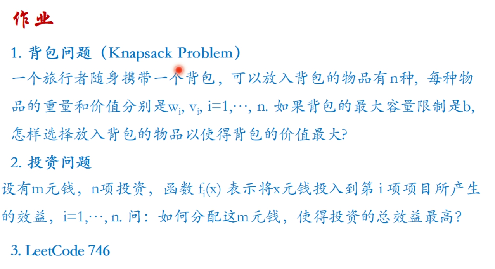
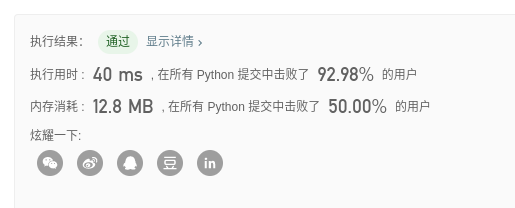

# Algorithm Homework 7

> 姓名：阙建明
>
> 学号：1901213139

## 作业要求：



## 题解：

- ### 背包问题

  - **算法思路：** 

    - 使用动态规划的思想；

    - 令`wArr`为重量数组，`vArr`为价值数组，b为背包的最大容量限制，定义`f[i]`为最大容量限制为i的情况下的最大价值，则状态转移方程如下：

      $f[b] = max\{f[b], f[b - wArr[i]] + vArr[i]\}$

    - 使用一维的dp数组保存中间的计算值

  - **代码：**

    ```python
    def getMaxValue(wArr, vArr, b):
        # 初始化dp数组
        dp = [0 for _ in range(b + 1)]
        for i in range(len(wArr)):
            for c in range(b, wArr[i] - 1, -1):
                dp[c] = max(dp[c], dp[c - wArr[i]] + vArr[i])
        return dp[b]
    
    if __name__ == '__main__':
        print(getMaxValue([1, 2, 5, 6, 7], [1, 6, 18, 22, 28], 11))
    
    # 输出
    40
    ```

- ### 投资问题

  - **算法思路：** 

    - 采用动态规划的思想

    - 定义$F_k(x)$表示前k个项目投资 x 元的最大收益， $f_k(x)$ 表示第k个项目投资x元的收益

    - 则状态转换方程如下：

      $F_k(x)  = \begin{cases}\max_{0 \le x_k \le x} \{f_k(x_k) + F_{k - 1}(x - x_k)\}&k > 1\\f_1(x) &k = 1 \end{cases}$

  - **代码：**

    ```python
    def getMaxProfit(f, x):
        """
        dp[i][j] 表示前 i + 1 个项目投资j元的最大收益
        :param f:
        :param x:
        :return:
        """
        columnNum = len(f[0])
        rowNum = len(f)
        dp = [[0 for _ in range(columnNum)] for _ in range(rowNum)]
        dp[0] = f[0]
        for i in range(1, len(f)):
            for j in range(0, x + 1):
                for k in range(0, j + 1):
                    if dp[i][j] < f[i][k] + dp[i - 1][j - k]:
                        dp[i][j] = f[i][k] + dp[i - 1][j - k]
        return dp[rowNum - 1][columnNum - 1]
    
    
    if __name__ == '__main__':
        print(getMaxProfit([
            [0, 11, 12, 13, 14, 15],
            [0, 0, 5, 10, 15, 20],
            [0, 2, 10, 30, 32, 40],
            [0, 20, 21, 22, 23, 24]
        ], 5))
        
    # 输出
    61
    ```

- ### Leetcode problem 746

  >  [使用最小花费爬楼梯](https://leetcode-cn.com/problems/min-cost-climbing-stairs/)

  - **算法思路：** 

    动态规划。反向遍历，由于当前状态只取决于前两个状态，所以dp table可以精简为只用两个数表示

  - **Leetcode提交结果：**

    

  - **代码：**

    ```python
  class Solution(object):
        def minCostClimbingStairs(self, cost):
          f1 = f2 = 0	# 顶部cost为0
            for x in reversed(cost):
                f1, f2 = x + min(f1, f2), f1
            return min(f1, f2)
    ```

